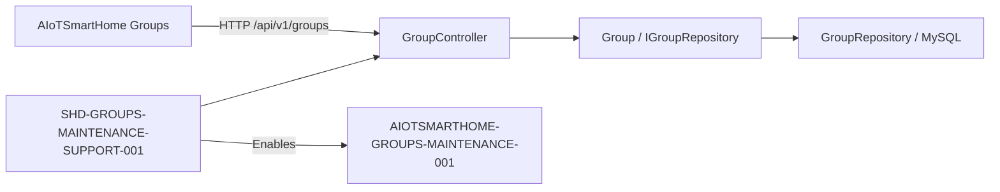

# EKM — Mapa das Fontes de Verdade

**Tipo:** Normativo

**Status:** Active

**Última auditoria:** 02/09/2026

## 1. Governança

| Área | Fonte | Tipo | Estado |
|---|---|---|---|
| Bootstrap dos agentes | `AGENTS.md` | Normativo | Active |
| Política de build e validação | `AGENTS.md` + especificação aplicável | Normativo | Active |
| Conceito EKM | `/Users/marcelocostamiranda/source/EKM-guidelines/docs/EKM-CONCEPT.md` | Referência externa | Dynamic |
| Método EKM | `/Users/marcelocostamiranda/source/EKM-guidelines/docs/EKM-METHOD.md` | Referência externa | Dynamic |
| Governança EKM | `/Users/marcelocostamiranda/source/EKM-guidelines/docs/GOVERNANCE.md` | Referência externa | Dynamic |
| Coordenação por atores | `/Users/marcelocostamiranda/source/EKM-guidelines/docs/experiments/COORDINATED-ACTOR-MODEL.md` | Protocolo experimental externo | Proposed |
| Mapa de conhecimento | `docs/rfc/KNOWLEDGE-MAP.md` | Normativo | Active |
| Histórico e transações | `docs/rfc/EKM-CHANGELOG.md` | Operacional | Active |
| Visão do sistema | `docs/specs/SYSTEM-DOSSIER.md` | Informativo | Draft |

## 2. Índice de domínios e autoridade

### 2.1 Referência de produção

**Decisão confirmada pelo arquiteto:** a branch `main` é a referência de
produção do projeto.

As branches `qa` e `homolog` permanecem previstas para adoção futura. Não são
gates obrigatórios enquanto seu processo não estiver especificado e aprovado.

### 2.2 Domínios

| Domínio | Fonte normativa | Implementação principal | Evidência atual | Cobertura |
|---|---|---|---|---|
| Devices | `EKM-GAP-0001` | `src/Api/Controllers/DeviceController.cs`, `src/Core/Entities/Device.cs`, `src/Data.Repositories/Repositories/DeviceRepository.cs` | Código e build | Inventoried |
| Capabilities e histórico | `EKM-GAP-0001` | `src/Api/Controllers/CapabilityController.cs`, `src/Api/Controllers/CapabilityHistoryController.cs`, `src/Core/Services/AddCapabilityService.cs`, repositórios relacionados | Código e build | Inventoried |
| Settings globais e de device | `SHD-SETTINGS-RESET-001@0.1` + `EKM-GAP-0001` | `src/Api/Controllers/SettingsController.cs`, `src/Api/Controllers/DeviceSettingsController.cs`, `src/Data.Repositories/Repositories/SettingsRepository.cs`, `src/Data.Repositories/Repositories/DeviceSettingsRepository.cs` | Código, inspeção das queries e especificação de reset de settings específicos | Mapped |
| Properties | `EKM-GAP-0001` | `src/Api/Controllers/PropertiesController.cs`, `src/Data.Repositories/Repositories/PropertyRepository.cs` | Código e build | Inventoried |
| Groups | `SHD-GROUPS-MAINTENANCE-SUPPORT-001@0.1`, `EKM-GAP-0001`, `EKM-GAP-0002` | `src/Api/Controllers/GroupController.cs`, modelos HTTP de Groups, `src/Core/Entities/Group.cs`, `src/Data.Repositories/Repositories/GroupRepository.cs` e queries relacionadas | Implementação v0.1 e build Release; validação MySQL `Not Executed` | Mapped |
| Métricas de device | `EKM-GAP-0001` | `src/Api/Controllers/DeviceMetricsController.cs`, `src/Data.Repositories/Repositories/DeviceMetricsRepository.cs` | Código, schema MySQL parcial e build da API; `tests/Api.Tests` é registro histórico `Retired`, não evidência | Mapped |
| Tipos, plataformas e locais monitorados | `EKM-GAP-0001` | controllers, entidades e repositórios correspondentes | Código e build | Inventoried |
| OAuth | `EKM-GAP-0001` | `src/Api/Controllers/OAuth/OAuthController.cs`, entidades e repositórios OAuth | Código e build | Inventoried |
| Persistência | `EKM-GAP-0002` | `src/Data.Repositories`, `database/` | Queries Dapper e scripts parciais | Inventoried |
| Build, validação, imagem e operação | `AGENTS.md` + `docs/specs/SYSTEM-DOSSIER.md` + especificação aplicável | `src/Api/Api.csproj`, `src/Api/Dockerfile`, `.github/workflows/docker-api.yml`, `build.sh`, `docker-compose.swarm.yaml` | Build canônico da API e validações declaradas por especificação; `tests/Api.Tests` é ignorado globalmente | Mapped |

## 3. Árvore de conhecimento

```text
SmartHome-DeviceApi
├── Contratos normativos
│   ├── Suporte à manutenção de Groups
│   └── Contratos funcionais ainda abertos em EKM-GAP-0001
├── API e modelos HTTP
├── Core e contratos de repositório
├── Persistência MySQL
└── Consumidores
    └── AIoTSmartHome — manutenção de Groups
```

## 4. Diagrama de relações



## 5. Lacunas

| ID | Estado | Lacuna | Critério de encerramento | Dependência |
|---|---|---|---|---|
| `EKM-GAP-0001` | Open | Parte dos contratos funcionais vigentes ainda não possui especificações EKM próprias; o reset de settings específicos de device foi coberto por `SHD-SETTINGS-RESET-001@0.1`, permanecendo os demais recortes em aberto. | Criar e aprovar especificações incrementalmente por domínio, usando specification on touch. | Priorização do arquiteto e mudanças funcionais. |
| `EKM-GAP-0002` | Open | O schema MySQL completo e sua autoridade de criação/migração não estão preservados no repositório; há scripts parciais e um `init.sql` com sintaxe de outro SGBD. | Identificar e registrar a fonte autoritativa do schema MySQL, incluindo tabelas e views consumidas pelas queries. | Inventário do banco vigente e decisão sobre migrações. |
| `EKM-GAP-0003` | Open | A suíte `tests/Api.Tests` foi descontinuada globalmente por decisão humana e deve permanecer ignorada; porém, `src/SmartHome-Api.sln` ainda referencia o projeto histórico e não existe uma estratégia automatizada substituta geral para os demais domínios. | Remover a referência legada da solução em mudança autorizada e garantir que cada especificação afetada declare evidências de validação suficientes, sem reativar ou reparar `tests/Api.Tests`. | Reconciliação de implementação separada e especificações incrementais. |
| `EKM-GAP-0004` | Open | A política de segredos e configurações operacionais não está documentada, e existe configuração sensível em artefato versionado de deploy. | Remover segredos versionados, rotacionar os valores afetados e documentar a fonte segura de configuração. | Decisão e execução operacional autorizadas. |
| `EKM-GAP-0005` | Open | O apontamento absoluto para a EKM externa é específico da máquina e não possui resolução portátil. | Especificar e validar um mecanismo portátil quando o experimento exigir execução em outra máquina ou automação. | Evidência de necessidade; não bloqueia o experimento local. |

## 6. Débitos técnicos

Nenhum débito técnico foi aceito pelo Arquiteto neste mapa. Lacunas e riscos
observados permanecem na seção 5 até decisão humana de disposição.

## 7. Manutenção

Atualize este mapa quando uma fonte, autoridade, responsabilidade, evidência,
estado ou lacuna mudar. Não remova uma entrada sem indicar o destino do
conhecimento.
