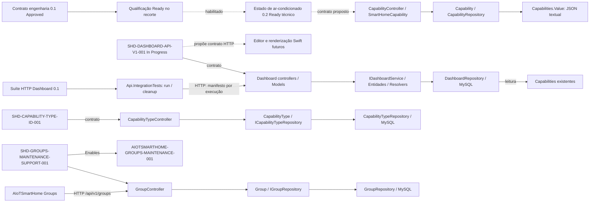

# EKM — Mapa das Fontes de Verdade

**Tipo:** Normativo

**Status:** Active

**Última auditoria:** 02/09/2026

## 1. Governança

| Área | Fonte | Tipo | Estado |
|---|---|---|---|
| Contrato de engenharia (recorte capabilities) | [SHD-ENGINEERING-001@0.1](REPOSITORY-ENGINEERING-CONTRACT.md) | Normativo | Approved 0.1; escopo capabilities |
| Qualificação do recorte | [Repository Readiness](REPOSITORY-READINESS.md) | Operacional | Ready no recorte; aprovação humana registrada |
| Bootstrap dos agentes | `AGENTS.md` | Normativo | Active |
| Política de build e validação | `AGENTS.md` + especificação aplicável | Normativo | Active |
| Conceito EKM | `/Users/marcelocostamiranda/source/EKM-guidelines/docs/EKM-CONCEPT.md` | Referência externa | Dynamic |
| Método EKM | `/Users/marcelocostamiranda/source/EKM-guidelines/docs/EKM-METHOD.md` | Referência externa | Dynamic |
| Governança EKM | `/Users/marcelocostamiranda/source/EKM-guidelines/docs/GOVERNANCE.md` | Referência externa | Dynamic |
| Coordenação por atores | `/Users/marcelocostamiranda/source/EKM-guidelines/docs/experiments/COORDINATED-ACTOR-MODEL.md` | Protocolo experimental externo | Proposed |
| Mapa de conhecimento | `docs/rfc/KNOWLEDGE-MAP.md` | Normativo | Active |
| Histórico e transações | `docs/rfc/EKM-CHANGELOG.md` | Operacional | Active |
| Visão do sistema | `docs/specs/SYSTEM-DOSSIER.md` | Informativo | Draft |

## 2. Índice de domínios e autoridade

### 2.1 Referência de produção

**Decisão confirmada pelo arquiteto:** a branch `main` é a referência de
produção do projeto.

As branches `qa` e `homolog` permanecem previstas para adoção futura. Não são
gates obrigatórios enquanto seu processo não estiver especificado e aprovado.

### 2.2 Domínios

| Domínio | Fonte normativa | Implementação principal | Evidência atual | Cobertura |
|---|---|---|---|---|
| Devices | `EKM-GAP-0001` | `src/Api/Controllers/DeviceController.cs`, `src/Core/Entities/Device.cs`, `src/Data.Repositories/Repositories/DeviceRepository.cs` | Código e build | Inventoried |
| Estado composto de ar-condicionado | [SHD-AIR-CONDITIONER-STATE-001@0.2](../specs/AIR-CONDITIONER-STATE.md) | CapabilityController, modelos Core/API e CapabilityRepository (alterações propostas) | [Análise 0.2 Ready](../reports/AIR-CONDITIONER-STATE/analysis/2026-09-24T005515Z-0.2-b36f13f3-3d18-43a2-a437-176e65d33011-implementability-analysis.md); decisões incorporadas; qualificação do recorte Ready; sem implementação | Draft / Ready técnico |
| Capabilities e histórico | `EKM-GAP-0001` | `src/Api/Controllers/CapabilityController.cs`, `src/Api/Controllers/CapabilityHistoryController.cs`, `src/Core/Services/AddCapabilityService.cs`, repositórios relacionados | Código e build | Inventoried |
| Settings globais e de device | `SHD-SETTINGS-RESET-001@0.1` + `EKM-GAP-0001` | `src/Api/Controllers/SettingsController.cs`, `src/Api/Controllers/DeviceSettingsController.cs`, `src/Data.Repositories/Repositories/SettingsRepository.cs`, `src/Data.Repositories/Repositories/DeviceSettingsRepository.cs` | Código, inspeção das queries e especificação de reset de settings específicos | Mapped |
| Properties | `EKM-GAP-0001` | `src/Api/Controllers/PropertiesController.cs`, `src/Data.Repositories/Repositories/PropertyRepository.cs` | Código e build | Inventoried |
| Groups | `SHD-GROUPS-MAINTENANCE-SUPPORT-001@0.1`, `EKM-GAP-0001`, `EKM-GAP-0002` | `src/Api/Controllers/GroupController.cs`, modelos HTTP de Groups, `src/Core/Entities/Group.cs`, `src/Data.Repositories/Repositories/GroupRepository.cs` e queries relacionadas | Especificação v0.1 concluída; implementação, build Release e validação aceita pelo Arquiteto | Mapped |
| Métricas de device | `EKM-GAP-0001` | `src/Api/Controllers/DeviceMetricsController.cs`, `src/Data.Repositories/Repositories/DeviceMetricsRepository.cs` | Código, schema MySQL parcial e build da API; `tests/Api.Tests` é registro histórico `Retired`, não evidência | Mapped |
| Capability Types por id | `SHD-CAPABILITY-TYPE-ID-001@0.2` + `EKM-GAP-0001` | `src/Api/Controllers/CapabilityTypeController.cs`, modelo HTTP, contrato do Core e repositório/queries correspondentes | Versão 0.2 Done; build aprovado, validação e testes aceitos pelo Arquiteto | Mapped |
| Dashboard API v1 | [SHD-DASHBOARD-API-V1-001@0.3](../specs/DASHBOARD-API-V1.md) | Dashboard controllers/models, IDashboardService/Resolvers, entidades e queries Dapper | Ready; entrega anterior rejeitada; [reimplementação e build](../reports/DASHBOARD-API-V1/implementation/2026-09-05T233757Z-0.3-c7fc139b-4018-4bea-b6d3-6b35860a446a-reimplementation.md) para Revisão, aceite operacional pendente | In Progress |
| Suíte HTTP Dashboard | [SHD-DASHBOARD-API-INTEGRATION-TESTS-001@0.1](../specs/DASHBOARD-API-INTEGRATION-TESTS.md) | [tests/Api.IntegrationTests](../../tests/Api.IntegrationTests/README.md), `Makefile` (run-test/clear-test), run/cleanup e manifesto | [Build aprovado](../reports/DASHBOARD-API-INTEGRATION-TESTS/implementation/2026-09-06T023221Z-0.1-580c8d1e-f5fc-4ff1-b50e-7aef3801c25c-implementation.md); nenhum cenário executado | In Progress |
| Demais tipos, plataformas e locais monitorados | `EKM-GAP-0001` | controllers, entidades e repositórios correspondentes | Código e build | Inventoried |
| OAuth | `EKM-GAP-0001` | `src/Api/Controllers/OAuth/OAuthController.cs`, entidades e repositórios OAuth | Código e build | Inventoried |
| Persistência | `EKM-GAP-0002` | `src/Data.Repositories`, `database/` | Queries Dapper e scripts parciais | Inventoried |
| Build, validação, imagem e operação | `AGENTS.md` + `docs/specs/SYSTEM-DOSSIER.md` + especificação aplicável | `src/Api/Api.csproj`, `src/Api/Dockerfile`, `.github/workflows/docker-api.yml`, `build.sh`, `docker-compose.swarm.yaml` | Build canônico da API e validações declaradas por especificação; `tests/Api.Tests` é ignorado globalmente | Mapped |

## 3. Árvore de conhecimento

```text
SmartHome-DeviceApi
├── Contratos normativos
│   ├── Contrato de engenharia 0.1 (Approved; capabilities)
│   ├── Repository Readiness (Ready no recorte aprovado)
│   ├── Estado composto de ar-condicionado (0.2; análise Ready; sem implementação)
│   ├── Dashboard API v1 (In Progress; reimplementação para Revisão)
│   ├── Suíte HTTP Dashboard (In Progress; criada/compilada, não executada)
│   ├── Capability Types por id (Done)
│   ├── Suporte à manutenção de Groups
│   └── Contratos funcionais ainda abertos em EKM-GAP-0001
├── API e modelos HTTP
├── Core e contratos de repositório
├── Persistência MySQL
└── Consumidores
    └── AIoTSmartHome — manutenção de Groups
```

## 4. Diagrama de relações



## 5. Lacunas

| ID | Estado | Lacuna | Critério de encerramento | Dependência |
|---|---|---|---|---|
| `EKM-GAP-0001` | Open | Parte dos contratos funcionais vigentes ainda não possui especificações EKM próprias; o reset de settings específicos de device foi coberto por `SHD-SETTINGS-RESET-001@0.1`, permanecendo os demais recortes em aberto. | Criar e aprovar especificações incrementalmente por domínio, usando specification on touch. | Priorização do arquiteto e mudanças funcionais. |
| `EKM-GAP-0002` | Open | O schema MySQL completo e sua autoridade de criação/migração não estão preservados no repositório; há scripts parciais e um `init.sql` com sintaxe de outro SGBD. | Identificar e registrar a fonte autoritativa do schema MySQL, incluindo tabelas e views consumidas pelas queries. | Inventário do banco vigente e decisão sobre migrações. |
| `EKM-GAP-0003` | Open | A suíte `tests/Api.Tests` foi descontinuada globalmente por decisão humana e deve permanecer ignorada; porém, `src/SmartHome-Api.sln` ainda referencia o projeto histórico e não existe uma estratégia automatizada substituta geral para os demais domínios. | Remover a referência legada da solução em mudança autorizada e garantir que cada especificação afetada declare evidências de validação suficientes, sem reativar ou reparar `tests/Api.Tests`. | Reconciliação de implementação separada e especificações incrementais. |
| `EKM-GAP-0004` | Open | A política de segredos e configurações operacionais não está documentada, e existe configuração sensível em artefato versionado de deploy. | Remover segredos versionados, rotacionar os valores afetados e documentar a fonte segura de configuração. | Decisão e execução operacional autorizadas. |
| `EKM-GAP-0005` | Open | O apontamento absoluto para a EKM externa é específico da máquina e não possui resolução portátil. | Especificar e validar um mecanismo portátil quando o experimento exigir execução em outra máquina ou automação. | Evidência de necessidade; não bloqueia o experimento local. |

## 6. Débitos técnicos

Nenhum débito técnico foi aceito pelo Arquiteto neste mapa. Lacunas e riscos
observados permanecem na seção 5 até decisão humana de disposição.

## 7. Análise de Capability Types por id

Análise: `docs/reports/CAPABILITY-TYPE-ID/analysis/2026-09-05T011011Z-0567d22b-92cb7a87-7715-44ab-b007-9a3acecb5b82-implementability-analysis.md`.
Classificação `Ready` para a versão 0.2, SHA-256 `0567d22b2b1a3b0a376893a6b52cf67e1d071309472bba89b70ec12b5042066d`.
Implementação: `docs/reports/CAPABILITY-TYPE-ID/implementation/2026-09-05T011121Z-0567d22b-3af01aa2-0190-4147-9641-18a4b5044986-implementation.md`.
GET individual somente em `/api/v1/capabilities-types/{id}`; Location do POST
por id. Versão 0.2 Concluída (`Done`) por decisão humana após declaração de
validação e testes; promoção para main autorizada.
O SHA-256 identifica o snapshot analisado; os metadados de estado e o registro
da decisão de encerramento foram atualizados posteriormente, sem mudança
funcional. Relatórios anteriores permanecem históricos.

## 8. Manutenção

Atualize este mapa quando uma fonte, autoridade, responsabilidade, evidência,
estado ou lacuna mudar. Não remova uma entrada sem indicar o destino do
conhecimento.
